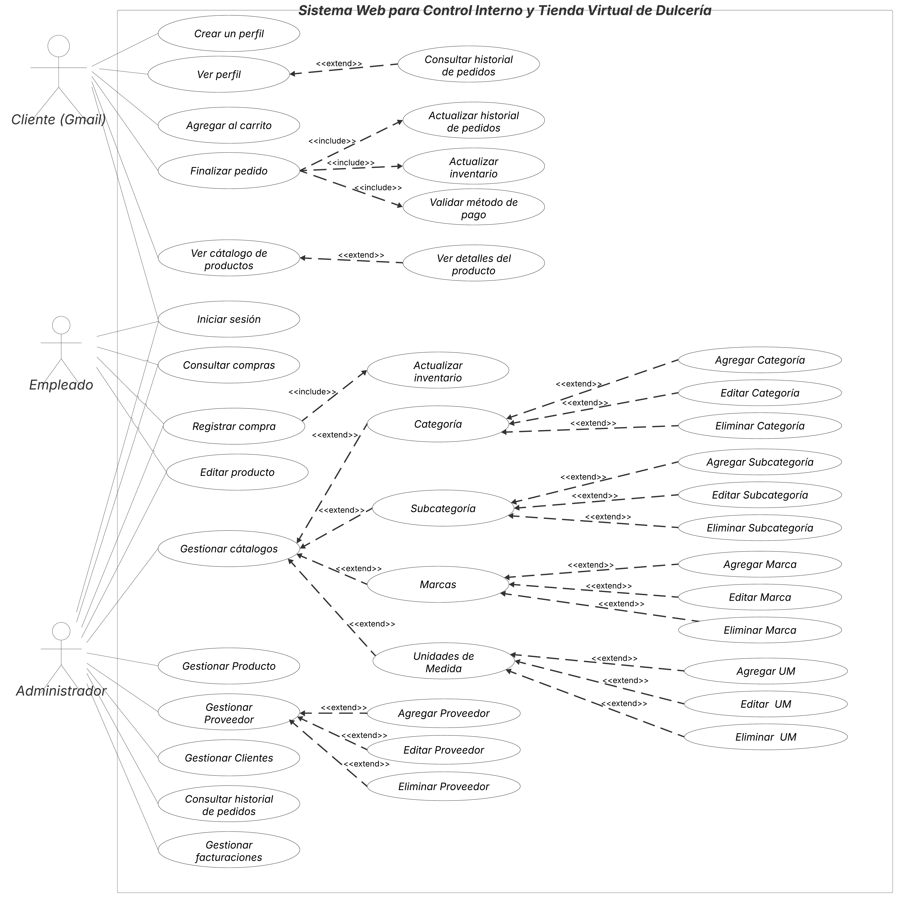

215569 - Stephanie Jaime

Sistema Web para Control Interno y Tienda Virtual de Dulcería

El sistema permite a una dulcería gestionar internamente su inventario, compras y proveedores, mientras ofrece una tienda virtual para que los usuarios registrados con Gmail puedan explorar los productos disponibles y agregarlos a un carrito. A través de un panel administrativo, los encargados pueden registrar nuevas compras, mantener actualizado el catálogo de productos, y organizar la información por categorías, marcas y unidades de medida. El acceso está controlado por tipo de usuario: los administradores tienen control total sobre todas las funciones del sistema; los empleados pueden consultar, editar y registrar información, pero no tienen permiso para eliminar o crear productos ni proveedores; y los clientes acceden únicamente a la tienda en línea, donde pueden navegar por el catálogo y seleccionar productos, simulando una experiencia de compra completa.

Actores involucrados:
Administrador: Tiene acceso completo a todos los módulos del sistema, incluyendo productos, compras, proveedores, catálogos y configuración general, sin ninguna restricción.
Empleado: Puede consultar y registrar compras, así como editar la información de los productos.
Usuario final (cliente con Gmail): Accede a la tienda virtual, donde puede explorar el catálogo de productos, agregar artículos al carrito y realizar pedidos.

Requisitos funcionales:
| ID    | Nombre                    | Descripción                                                                 |
|-------|---------------------------|-----------------------------------------------------------------------------|
| RF01  | Registro de compras       | Permite registrar proveedor, fecha, factura y tiempo estimado de suministro.|
| RF02  | Gestión de productos      | Agregar, eliminar y buscar productos por código y marca.                    |
| RF03  | Gestión de proveedores    | Almacena nombre, teléfono y correo electrónico de proveedores.              |
| RF04  | Clasificación de productos| Organiza productos por categorías definidas.                                |
| RF05  | Control de inventario     | Actualiza inventario automáticamente en compras y ventas.                   |
| RF06  | Catálogo para usuarios    | Visualización de productos en formato de catálogo.                          |
| RF07  | Restricción a empleados   | Empleados no pueden eliminar productos o proveedores.                       |
| RF08  | Registro de ventas        | Permite guardar fecha, productos vendidos y total de la venta.              |

Requisitos no funcionales:
| ID     | Nombre                   | Descripción                                                                  |
|--------|--------------------------|------------------------------------------------------------------------------|
| RNF01  | Rendimiento del sistema  | Consultas y registros deben ejecutarse rápidamente.                          |
| RNF02  | Escalabilidad            | Soporta más productos, clientes y proveedores sin afectar el rendimiento.    |
| RNF03  | Seguridad de datos       | Protege contra pérdidas o modificaciones no autorizadas.                     |
| RNF04  | Alta disponibilidad      | Acceso constante al sistema sin interrupciones significativas.               |
| RNF05  | Interfaz intuitiva       | Fácil de usar para personas sin experiencia técnica.                         |
| RNF06  | Compatibilidad           | Funciona en navegadores modernos y dispositivos móviles.                     |
| RNF07  | Tiempo de respuesta      | Las operaciones deben completarse en menos de 2 segundos.                    |

